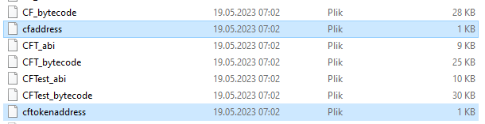

[![MIT License][license-shield]][license-url]

<!-- PROJECT LOGO -->
<br />
<div align="center">
  <a href="https://github.com/othneildrew/Best-README-Template">
    
  </a>

  <h3 align="center">ChainFit Repository Description</h3>

  <p align="center">
    A blockchain app that encourages people to be active
    <br />
    <br />
    <br />
    <a href="https://vimeo.com/828399505/0ea8991f12">View Demo</a>
  </p>
</div>

## About The Project
ChainFit is an application that utilizes blockchain technology to incentivize individuals to engage in physical fitness activities. Through the integration of blockchain, the app creates a decentralized platform that encourages people to adopt a healthy lifestyle.


The repository consists of several parts:
* **Analyzes** - here you can find a detailed description of the application development and maintenance plans. The average costs assumed by the authors and the analysis of existing solutions on the market have been calculated.
* **Client folder** - this folder contains a description of the technologies used and a description of the installation to run and edit the application. The folder contains all the files responsible only for the frontend part of the application.
* **Ethernum** - backend part of our application. Here you can find a description of the technologies used and a description of the most important methods.
* **Test** - folder with scripts responsible for generating sample data that were used to test the application.


In addition to the listed folders, there are also:
* **./github/workflows** - description of building and testing and publishing the latest versions of our application in the repository.
* **ganache** - folder containing instructions for building the Docker Ganache image.

<!-- CONTACT -->
## Authors

The project was made by
* **Miłosz Szkudlarek** (leader of the team)
* **Julia Błaszczyk**
* **Adam Miernicki**

<!-- GETTING STARTED -->
# Start of application

## Start application locally

# Prerequirements
* Ganache
* Node.js
* Npm
* Metamask web extension

To run chainFit application locally is few steps that we need to configure first.

1. ### Configure Ganache 
Run Ganache on locacalhost:8545 (different port) and create local blockchain.

2. ### Connect Metamask 
Connect Metamask wallet account to Ganache network and to generated address (by private key)

3. ### Deploy Token
Deploy chainFit token by command

```sh
node ./test/deployToken.js
```
4. ### Change the token address in frontend client
To change token address in our frontend client we need to copy result of command *node ./server/deployToken.js* to file ./client/src/web3/SmartContract.jsx and change address in cftokenaddress (as on printscreen below)
<br />
<div align="center">
    <a href="https://github.com/othneildrew/Best-README-Template">
    
  </a>
</div>


5. ### Deploy ChainFit contract
To deploy ChainFit contract we need to use command:

```sh
node ./test/deploy.js
```

6. ### Change the  address in frontend client
To change token address in our frontend client we need to copy result of command *node ./server/deployToken.js* to file ./client/src/web3/SmartContract.jsx and change address in cftokenaddress

```sh
node ./test/setupCFT.js
```

### 7 (extra step) Add random data
In extra step to test our app we can add extra random data. To do that we need to enter command
```sh
node ./test/insertTestData.js
```

### Photo server
8. ### Photo server
To store images made by users on server we need to run server. To do that we need to have installed Node.js with npm. By npm command

```sh
npm node serverPhoto.js
npm ./server/savePhoto.js
```
we can start server to store user photos.


9. ### Install all packages for frontend client
To install all important packages to run frontend client we need to execute command
```sh
npm install ./client
```
10. ### Run our client app!
To run our client app we need to enter command
``` sh
npm run dev ./client
```
and enter on webpage to adrress
```sh
localhost:3000
```

## Start on docker
### Client (docker has only client image!)


## Start on docker
### Client (docker has only client image!)
By downloading the entire repo material, it is possible to create and run a client folder image container using Docker.

To run a given image, we must have Docker installed and be in the root folder of the repository. Then we can run the application with this command
  ```sh
  docker-compose up
  ```
To check the operation of our application, launch the browser and type in it address:
```sh
  localhost:80
  ```
or in case of some problems
```sh
  127.0.0.1:80
  ```
The frontend application in the docker image starts in development mode, which means that in a given mode we also have access to, for example, error messages and the performance of the application will not be fully optimized.

In addition to the repository, it is possible to download the latest built version of the application thanks to githubaction from dockerhub
https://hub.docker.com/r/adammiernicki/franklinfrontend
## License

Distributed under the MIT License. See `LICENSE.txt` for more information.

<p align="right">(<a href="#readme-top">back to top</a>)</p>

<!-- MARKDOWN LINKS & IMAGES -->
<!-- https://www.markdownguide.org/basic-syntax/#reference-style-links -->
[license-shield]: https://img.shields.io/github/license/othneildrew/Best-README-Template.svg?style=for-the-badge
[license-url]: https://github.com/othneildrew/Best-README-Template/blob/master/LICENSE.txt
